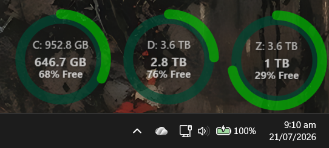

# Disk Space Monitor

A borderless desktop widget that sits **behind** all your other windows (like a
wallpaper gadget) and shows remaining space on your drives. Pick a **style** from
the settings dialog: the **Circular gauge** (one gauge per drive, each its own
window you can place and size independently), **Concentric circles** (a single
window drawing every drive as a nested ring), or a **Bar graph** (a bar per drive
on a 0–100% axis).



## Features

- **Three widget styles** – choose the look from a **Widget** dropdown:
  - **Circular gauge** – one gauge per drive; the ring fills with used space and
    its colour shifts green → amber → red as free space runs low. The centre shows
    the drive letter and total size, the free space, and the percentage free.
  - **Concentric circles** – a single window drawing every drive as a nested ring
    (innermost = first drive), each swept to that drive's used %, with a small
    label chip ("`C 90%`") coloured by the drive's status. Ring thickness, the
    per-drive ring colours, the status colours, and the unused-space transparency
    are all configurable. Labels nudge apart automatically so they never overlap.
  - **Bar graph** – a single window with a vertical bar per drive on a 0–100%
    (used space) axis, each bar coloured by status. Bar width, the unused-space
    transparency, colours and thresholds are configurable, and the used and total
    space per drive can optionally be shown on/above each bar.
- **Pluggable widget styles** – new styles plug in by implementing a single
  interface, with their own settings tabs, in their own `Widgets/<Name>/` folder.
  Each style remembers its own configuration independently.
- **Multiple drives** – managed from the settings dialog (at least one is always
  shown): the Circular style shows one gauge per drive; Concentric and Bar graph
  show them all in one window.
- **Colour picker** – every colour is edited from a row with a live swatch and an
  editable `#RRGGBB` box (copy/paste), plus a pipette button that opens a
  hue/saturation/brightness chooser with gradient sliders and a live preview.
- **Always behind** – pinned to the bottom of the window Z-order; hidden from
  Alt-Tab and the taskbar; never steals focus.
- **Transparent** – no window chrome, just a subtle dark disc behind the gauge
  for readability over any wallpaper.
- **Click-through when idle** – normally your clicks pass straight through to the
  desktop. Hold **Ctrl** to make the widget interactive.
- **Snapping & no overlap** – dragging snaps to other widgets and to screen edges
  (stopping at the taskbar), keeps the whole widget on-screen, moves freely across
  multiple monitors, and never lets widgets overlap.
- **Customisable appearance** – opacities, ring thickness, and the colour of every
  part, all with a live preview.
- **Configurable thresholds** – choose the free-space percentages at which a drive
  turns "low" and "critical" (colouring the Circular ring or the Concentric chip).
- **Auto-start** – optionally launch at login (a per-user `Run` registry entry).
- **Efficient** – idle between refreshes; a single low-level keyboard hook wakes
  the UI only while Ctrl is held (no continuous polling). The working set is
  trimmed while idle to keep the memory footprint small.
- **Remembers** every setting: each widget's position and size, the refresh
  interval, thresholds, and all appearance choices — and each style keeps its own
  configuration, so switching styles (or restarting) never loses it.

## Controls

| Action    | How                                                            |
|-----------|----------------------------------------------------------------|
| Move      | Hold **Ctrl**, click-drag anywhere on the widget               |
| Resize    | Hold **Ctrl**, hover, drag a corner handle                     |
| Settings  | Hold **Ctrl**, click the ⚙ button, or right-click → Settings…  |
| Hide one  | Right-click → **Hide this drive** (Circular style only)        |
| Quit      | Settings → **Exit Application**, or right-click → Exit application |

## Project structure

A single solution with the app and its tests in separate project folders:

```
DiskSpaceMonitor.slnx
DiskSpaceMonitor/              # WPF app
  App.xaml(.cs)               # composition root + window/lifecycle manager
  Drives/                     # ByteSize, DiskGauge, DriveReader, DriveCatalog, records
  Widgets/                    # widget abstraction (IWidget, WidgetRegistry, RingArc, …)
    Circular/                 # circular gauge – one window per drive (view, config, editor)
    Concentric/               # concentric circles – one window, a ring per drive
    Bar/                      # bar graph – one window, a bar per drive
  Layout/                     # WidgetLayout (snapping + collision geometry)
  Settings/                   # WidgetSettings, JsonSettingsStore
  Startup/                    # AutoStartService (HKCU Run entry)
  Interop/                    # NativeMethods, CtrlHook (Win32)
  Diagnostics/                # ErrorLog
  Views/                      # MainWindow, SettingsWindow, shared controls
DiskSpaceMonitor.UnitTests/   # NUnit + FluentAssertions, mirrors the app folders
```

UI-free logic (geometry, byte formatting, gauge thresholds, widget config
serialization, settings load/save/migration) lives in small services behind
interfaces, so it's covered by unit tests; the WPF views are thin.

**Adding a widget style:** drop a new folder under `Widgets/<Name>/` implementing
`IWidget` (metadata, view, config codec, settings tabs) and register it in the
`WidgetRegistry` — nothing style-specific leaks into the rest of the app.

## Requirements

- Windows 10/11
- [.NET 10 SDK](https://dotnet.microsoft.com/download) (to build) or the .NET 10
  Desktop Runtime (to run a published build)

## Run

```powershell
dotnet run --project DiskSpaceMonitor
```

## Test

```powershell
dotnet test
```

## Build a standalone executable

```powershell
dotnet publish DiskSpaceMonitor -c Release -r win-x64 --self-contained false
```

Or use the bundled folder profile, which publishes a Release build to
`C:\Tools\DiskSpaceMonitor`:

```powershell
dotnet publish DiskSpaceMonitor -p:PublishProfile=FolderProfile
```

Both are framework-dependent, so they need the .NET 10 Desktop Runtime installed.

## Settings

The settings dialog (⚙ button or right-click → Settings…) is tabbed:

- **General** – auto-start at login, refresh interval, the **Widget** style
  dropdown, and overall widget opacity.
- **Drives** – which drives to show (at least one is always kept).
- The selected widget then contributes its own tabs:
  - **Circular gauge** – *Appearance* (background opacity, ring thickness, and the
    free-space percentages at which the ring turns "low" and "critical") and
    *Colours* (the colour of each part of the gauge).
  - **Concentric circles** – *Appearance* (ring thickness, unused-space
    transparency, and the low/critical thresholds) and *Colours* (the label-text
    colour, the healthy/low/critical **chip status** colours, and a **ring colour
    per drive**).
  - **Bar graph** – *Appearance* (bar width, unused-space transparency, **Show
    used space** / **Show total space** toggles, and the low/critical thresholds)
    and *Colours* (label text, the unused-space track, and the healthy/low/critical
    status colours).

Each colour is edited with a swatch, an editable `#RRGGBB` box (copy/paste), and a
pipette button that opens a hue/saturation/brightness picker with gradient sliders
— everything previews live.

The chosen widget and its settings apply to every drive; **each style keeps its own
configuration**, so switching styles never discards another style's setup.
Appearance and colour changes preview live on all widgets; **Cancel** reverts them,
**OK** applies and saves.

All of this — drives, positions, sizes, refresh interval, thresholds, opacities,
ring thickness, and colours — is saved to:

```
%AppData%\DiskSpaceMonitor\settings.json
```

Delete that file to reset the widgets to defaults. A pre-multi-drive settings
file is migrated automatically on first load.

**Auto-start** is controlled by the *General* tab. When enabled it writes a
per-user `Run` entry named `DiskSpaceMonitor` under
`HKCU\Software\Microsoft\Windows\CurrentVersion\Run` pointing at the running
executable; disabling it removes the entry. Publish to a stable location (see
[Build a standalone executable](#build-a-standalone-executable) above) before
enabling, so the registered path doesn't point at a build folder.

## License

Licensed under the [MIT License](LICENSE). The application icon is original
artwork created for this project and is covered by the same licence — the
project bundles no third-party assets (see [attributions.md](attributions.md)).
