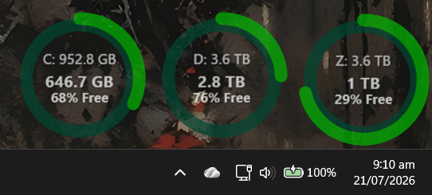
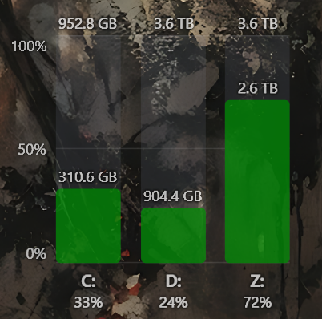
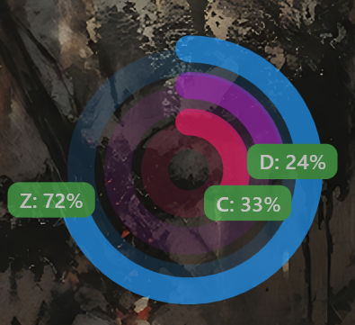

# Disk Space Monitor

A borderless desktop widget that sits **behind** all your other windows (like a
wallpaper gadget) and shows remaining space on your drives. Pick a **style** from
the settings dialog: the **Circular gauge** (one gauge per drive, each its own
window you can place and size independently), **Concentric circles** (a single
window drawing every drive as a nested ring), a **Vertical bar graph** or
**Horizontal bar graph** (a bar per drive on a 0–100% axis), or a **Box** (one
rounded panel per drive, listing its size and used space above a bar).



The same drives shown in two of the other styles — a vertical bar graph (with the
used and total space per drive) and concentric rings (each chip coloured by that
drive's status):

| Vertical bar graph | Concentric circles |
|:------------------:|:------------------:|
|  |  |

## Features

- **Five widget styles** – choose the look from a **Widget** dropdown:
  - **Circular gauge** – one gauge per drive; the ring fills with used space and
    its colour shifts green → amber → red as free space runs low. The centre shows
    the drive letter and total size, the free space, and the percentage free, with
    an optional outer glow behind the text.
  - **Concentric circles** – a single window drawing every drive as a nested ring
    (innermost = first drive), each swept to that drive's used %, with a small
    label chip ("`C 90%`") coloured by the drive's status. Ring thickness, the
    per-drive ring colours, the status colours, and the unused-space transparency
    are all configurable. Labels nudge apart automatically so they never overlap.
  - **Vertical bar graph** – a single window with a vertical bar per drive on a
    0–100% (used space) axis, each bar coloured by status. An **Orientation** of
    *Bottom Up* (0% at the bottom, bars growing up) or *Top Down* (0% at the top,
    bars hanging down), the gap between bars, how far their corners are rounded
    (square through to fully pill-shaped), the unused-space transparency, colours
    and thresholds are all configurable, and the 0–100% axis can be switched off to
    give its room to the bars. The bars always fill the window,
    so you set the graph's shape by dragging it (see below). The used and total
    space per drive can optionally be shown on/above each bar — those captions
    auto-size to one shared size that fits the bar, and rotate vertically when a
    bar is too narrow for horizontal text. An **Effects**
    tab picks a **Bar style** — *Plain*, *Border* (size + colour), or *3D Border*
    (size + highlight and lowlight colours, lit from the top left) — and adds an
    outer glow (radius + colour) behind all of its text.
  - **Horizontal bar graph** – the same graph turned on its side: a bar per drive
    running across a 0–100% axis, stacked down the window, with the drive label at
    the 0% end and the total at the 100% end. Its **Orientation** is *Left to Right*
    (0% at the left) or *Right to Left* (0% at the right), and it offers the same
    bar gap, corner rounding, transparency, colours, thresholds, captions, axis
    toggle, bar styles and glow as the vertical graph. Captions scale to the bar's
    slot rather than rotating, since a horizontal bar has the whole axis to write
    along.
  - **Box** – one rounded panel per drive holding three centred rows: the drive and
    its total size, the used space, and a bar filled to the used % and coloured by
    status. Width and height are dragged independently (side handles as well as
    corners) and the panel fills the result; the bar keeps its configured share of
    the height whatever shape you give it, and the two text rows split the rest. The
    panel and the bar are styled apart — each has its own corner rounding and its own
    *Plain* / *Border* / *3D Border* outline with its own width and colours — and the
    background and the border each have their own transparency, so the box can be
    anything from a solid slab to an outline with the desktop showing through.
- **Bar graphs and boxes stretch in either direction** – they get a resize handle at
  the centre of each side as well as at each corner, and the content fills whatever
  rectangle you drag: stretch a horizontal graph sideways and its bars lengthen,
  stretch it downwards and they thicken; a box does the same. There is no size cap
  beyond the monitor itself. The labels only change size when the widget grows in
  *both* directions, so a one-way stretch resizes the bars and leaves the text where
  it was — and they stop at the minimum text size, so a short one stays readable.
- **Pluggable widget styles** – new styles plug in by implementing a single
  interface, with their own settings tabs, in their own `Widgets/<Name>/` folder.
  Each style remembers its own configuration independently.
- **Multiple drives** – managed from the settings dialog (at least one is always
  shown): the Circular and Box styles show one window per drive; Concentric and both
  bar graphs show them all in one window.
- **One font for every widget** – the *General* tab picks the font all five styles
  draw with, previewed in the font itself, chosen from a dialog listing every
  installed family (each shown in its own face, with a filter box and a sample).
  **Minimum** and **maximum** text sizes bound what every widget renders, whatever
  size the widget itself is — so a gauge stretched across the screen doesn't turn
  its labels into a poster, and a small one keeps them readable.
- **Colour picker** – every colour is edited from a row with a live swatch and an
  editable `#RRGGBB` box (copy/paste), plus a pipette button that opens a
  hue/saturation/brightness chooser with gradient sliders and a live preview.
- **Always behind** – pinned to the bottom of the window Z-order; hidden from
  Alt-Tab and the taskbar; never steals focus.
- **Transparent** – no window chrome, just a subtle dark disc behind the gauge
  for readability over any wallpaper.
- **Click-through when idle** – normally your clicks pass straight through to the
  desktop. Hold **Ctrl** to make the widget interactive.
- **Snapping & no overlap** – dragging snaps to other widgets and to screen edges
  (stopping at the taskbar), keeps the whole widget on-screen, moves freely across
  multiple monitors, and never lets widgets overlap. Resizing snaps too: an edge you
  drag lines up with a neighbour's edge — flush against it, or level with its far
  side to match two widgets' widths — and stops there rather than crossing it.
- **Customisable appearance** – opacities, ring thickness, and the colour of every
  part, all with a live preview.
- **Configurable thresholds** – choose the free-space percentages at which a drive
  turns "low" and "critical" (colouring the Circular ring, the Concentric chip, or
  a bar in either bar graph or in a box).
- **Auto-start** – optionally launch at login (a per-user `Run` registry entry).
- **Efficient** – idle between refreshes; a single low-level keyboard hook wakes
  the UI only while Ctrl is held (no continuous polling). The working set is
  trimmed while idle to keep the memory footprint small.
- **Remembers** every setting: each widget's position and size, the refresh
  interval, thresholds, the font and text size bounds, and all appearance choices —
  and each style keeps its own configuration *and its own window rectangle*, so
  switching styles (or restarting) never loses it.

## Controls

| Action    | How                                                                  |
|-----------|----------------------------------------------------------------------|
| Move      | Hold **Ctrl**, click-drag anywhere on the widget                     |
| Resize    | Hold **Ctrl**, hover, drag a corner handle — or, on either bar graph or a box, a side handle to stretch that way alone |
| Settings  | Hold **Ctrl**, click the ⚙ button in the centre, or right-click → Settings… |
| Hide one  | Right-click → **Hide this drive** (Circular and Box styles)          |
| Quit      | Settings → **Exit Application**, or right-click → Exit application   |

## Project structure

A single solution with the app and its tests in separate project folders:

```
DiskSpaceMonitor.slnx
DiskSpaceMonitor/              # WPF app
  App.xaml(.cs)               # composition root + window/lifecycle manager
  Drives/                     # ByteSize, DiskGauge, DriveReader, DriveCatalog, records
  Widgets/                    # widget abstraction (IWidget, WidgetRegistry, RingArc,
                              #   WidgetTypography + GlobalAppearance, …)
    Circular/                 # circular gauge – one window per drive (view, config, editor)
    Concentric/               # concentric circles – one window, a ring per drive
    BarGraph/                 # shared by both bar graphs (config, editor, widget base, fill)
    VerticalBar/              # vertical bar graph – one window, a bar per drive
    HorizontalBar/            # horizontal bar graph – the same, turned on its side
    Box/                      # box – one rounded panel per drive, text above a bar
    Effects/                  # reusable widget effects (text outer glow)
  Layout/                     # WidgetLayout (snapping + collision geometry)
  Settings/                   # WidgetSettings, JsonSettingsStore
  Startup/                    # AutoStartService (HKCU Run entry)
  Interop/                    # NativeMethods, CtrlHook (Win32)
  Diagnostics/                # ErrorLog
  Views/                      # MainWindow, SettingsWindow, the colour and font
                              #   pickers, shared controls
DiskSpaceMonitor.UnitTests/   # NUnit + FluentAssertions, mirrors the app folders
```

UI-free logic (geometry, byte formatting, gauge thresholds, widget config
serialization, settings load/save/migration) lives in small services behind
interfaces, so it's covered by unit tests; the WPF views are thin.

**Adding a widget style:** drop a new folder under `Widgets/<Name>/` implementing
`IWidget` (metadata, view, config codec, settings tabs) and register it in the
`WidgetRegistry` — nothing style-specific leaks into the rest of the app. Its view
also takes the app-wide `WidgetTypography`, so its text uses the chosen font and
stays within the size bounds like every other style's.

## Requirements

- Windows 10/11
- [.NET 10 SDK](https://dotnet.microsoft.com/download) (to build) or the .NET 10
  Desktop Runtime (to run a published build)

## Run

```powershell
dotnet run --project DiskSpaceMonitor
```

## Test

```powershell
dotnet test
```

## Build a standalone executable

```powershell
dotnet publish DiskSpaceMonitor -c Release -r win-x64 --self-contained false
```

Or use the bundled folder profile, which publishes a Release build to
`C:\Tools\DiskSpaceMonitor`:

```powershell
dotnet publish DiskSpaceMonitor -p:PublishProfile=FolderProfile
```

Both are framework-dependent, so they need the .NET 10 Desktop Runtime installed.

## Settings

The settings dialog (the centred ⚙ button or right-click → Settings…) is tabbed:

- **General** – auto-start at login, refresh interval, the **Widget** style
  dropdown, overall widget opacity, and the app-wide **text** settings: the
  **font** (with a preview and a **Choose…** dialog listing every installed
  family) and the **minimum** and **maximum** sizes every widget holds its text
  within. These apply to all five styles, so text doesn't change when you switch.
- **Drives** – which drives to show (at least one is always kept).
- The selected widget then contributes its own tabs:
  - **Circular gauge** – *Appearance* (background opacity, ring thickness, and the
    free-space percentages at which the ring turns "low" and "critical"), *Colours*
    (the colour of each part of the gauge), and *Effects* (an outer-glow radius and
    colour behind the centre text).
  - **Concentric circles** – *Appearance* (ring thickness, unused-space
    transparency, and the low/critical thresholds) and *Colours* (the label-text
    colour, the healthy/low/critical **chip status** colours, and a **ring colour
    per drive**).
  - **Vertical bar graph** – *Appearance*, divided by a rule into what the graph
    shows (**Orientation** and the **Show vertical axis** / **Show used space** /
    **Show total space** toggles) and how it's drawn (**Gap between bars**, **Corner
    radius**, unused-space transparency and the low/critical thresholds);
    *Colours* (label text, the unused-space track,
    and the healthy/low/critical status colours), and *Effects* (a **Bar style** of
    Plain, Border or 3D Border with its size and colours, plus an outer-glow
    radius and colour applied behind all the widget's text). There is no bar-size
    setting: the bars fill the window, so the gap is all that divides them up.
  - **Horizontal bar graph** – the same three tabs and the same settings, with
    *Left to Right* / *Right to Left* orientations. It keeps its own copy of every
    setting — and its own window size and position — so the two graphs can be
    styled and shaped differently.
  - **Box** – *Appearance*, divided by a rule into the box's shape (**Corner radius**,
    **Bar corner radius** and the bar's share of the height) and how solidly it is
    painted (**Background** / **Border** / **Unused space** transparencies and the
    low/critical thresholds); *Colours* (the text and panel colours, the unused-space
    track, and the healthy/low/critical status colours); and an effects tab each for
    the panel and the bar — **Box effects** and **Bar effects** — since the two are
    outlined independently: a style of Plain, Border or 3D Border with its own width
    and colours. The text's outer glow sits with the box, which holds it.

Every setting sits on one row — a right-aligned caption, then its control, then its
value — with the captions in a column sized to the section showing, so the controls
line up down the page without a short caption being pushed out by a long one
elsewhere. Hovering any part of a row (caption, control or value) explains what that
setting affects.

Each colour is edited with a swatch, an editable `#RRGGBB` box (copy/paste), and a
pipette button that opens a hue/saturation/brightness picker with gradient sliders
— everything previews live.

The chosen widget and its settings apply to every drive; **each style keeps its own
configuration**, so switching styles never discards another style's setup.
Appearance and colour changes preview live on all widgets; **Cancel** reverts them,
**OK** applies and saves.

All of this — drives, positions, sizes, refresh interval, thresholds, opacities,
ring thickness, and colours — is saved to:

```
%AppData%\DiskSpaceMonitor\settings.json
```

Delete that file to reset the widgets to defaults. A pre-multi-drive settings
file is migrated automatically on first load.

**Auto-start** is controlled by the *General* tab. When enabled it writes a
per-user `Run` entry named `DiskSpaceMonitor` under
`HKCU\Software\Microsoft\Windows\CurrentVersion\Run` pointing at the running
executable; disabling it removes the entry. Publish to a stable location (see
[Build a standalone executable](#build-a-standalone-executable) above) before
enabling, so the registered path doesn't point at a build folder.

## License

Licensed under the [MIT License](LICENSE). The application icon is original
artwork created for this project and is covered by the same licence — the
project bundles no third-party assets (see [attributions.md](attributions.md)).
